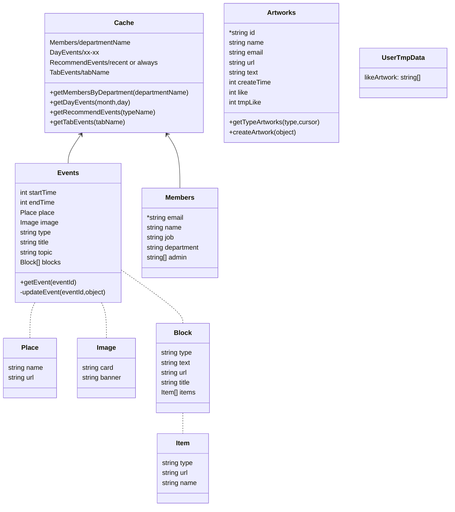

# ntuaf-sdk

## 目的

簡化 ntuaf 專案, 首頁前端資料庫操作

## 架構



## methods

### 常用列表獲取

```javascript
// 獲取部門成員
await getMembersByDepartment('策展部');
// 獲取近期/常設推薦事件
await getRecommendEvents('recent');
// 獲取當天事件
await getDayEvents(2, 28);
// 獲取大類別事件列表
await getTabEvents('展覽');
// 根據月份取得各天有哪些類別的事件
await getMonthsEventsType('4');
```

### 用戶相關

```javascript
// 登出
await logout();
// 獲取用戶信箱
userEmail();
// 獲取用戶唯一編號
userId();
// 訂閱登入狀態變更, 常用來抓自動登入產生的結果
subscriptAuthState(callback);
// google 第三方登入
await login();
// 獲取成員個資(含管理事件列表等)
await getMemberInfo();
// 獲取前一次第三方登入的結果(理論上用不太到)
await getLoginResult();
```

### 事件相關(EVENT)

```javascript
// 獲取事件詳細資料
await getEvent(id);
// 校正事件欄位
correctEvent(event);
// 更新事件
await updateEvent(id);
```

### 投稿相關(ARTWORK)

```javascript
// 投稿上轉
await createArtwork({...});
// 當日用戶喜歡的投稿的列表
await getLikeArtworkToday()
// 取得 Artwork 列表, with page
await getArtworkList({...})
// 喜歡或不喜歡某投稿
await triggerLikeArtwork({...})
```

### 其他功能

```js
// 單張圖片上傳
await uploadImage(url);
```

## sample

see each JSDoc for methods above

## types

列舉

```ts
/**
 * 投稿類別
 */
export enum ARTWORK_TYPE {
	PURE_TEXT = '純文字組',
	PHOTO = '照片組',
	PAINTING = '繪畫組',
}
/**
 * 部門分類
 */
export enum DEPARTMENT {
	'核心團隊' = '核心團隊',
	'策展部' = '策展部',
	'行政部' = '行政部',
	'公關部' = '公關部',
	'設計部' = '設計部',
}

/**
 * 事件分類
 */
export enum EVENT_TYPE {
	'展覽' = '展覽',
	'開幕式' = '開幕式',
	'閉幕式' = '閉幕式',
	'市集' = '市集',
	'舞台表演' = '舞台表演',
	'體驗實作' = '體驗活動',
	'講座' = '講座',
	'工作坊' = '工作坊',
	'講座/工作坊' = '講座/工作坊',
}

/**
 * 資訊塊分類
 */
export enum BlOCK_TYPE {
	TEXT_A,
	TEXT_B,
	TEXT_C,
	TEXT_D,
	IMAGE_A,
	IMAGE_B,
	LINK_A,
	MAP_A,
	MAP_B,
	VIDEO_A,
	IMAGE_LIST_A,
	IMAGE_LIST_B,
	IMAGE_LIST_C,
	IMAGE_LIST_D,
	IMAGE_LIST_E,
}

/**
 * 子資訊分類
 */
export enum ITEM_TYPE {
	圖片,
}
```

類別介面

```ts
/**
 * 投稿品, 用在行銷活動, 參與者的上傳結果
 * @property id 投稿編號
 * @property type 投稿的活動類別
 * @property name 作者姓名
 * @property artworkName 作品名稱
 * @property email 作者 email
 * @property url 圖片 url
 * @property text 文字內容
 * @property createTime 創建時間
 * @property like 喜歡數
 * @property tmpLike 暫存喜歡數(腳本確認後併入喜歡)
 */
export interface Artwork {
	id?: string;
	type: enums.ARTWORK_TYPE;
	name: string;
	artworkName: string;
	email: string;
	url: string;
	originUrl: string;
	text: string;
	createTime: number;
	like: number;
	tmpLike: number;
}
/**
 * 活動工作人員
 * @property id 用戶的 gmail
 * @property name 成員姓名
 * @property job 職位稱呼 ex: 組長/組員
 * @property department 隸屬部門
 * @property admin 管理事件列表
 */
export interface Member {
	id?: string;
	name: string;
	job: string;
	department: enums.DEPARTMENT;
	admin: string[];
}
/**
 * 活動事件
 * @property id 事件編號
 * @property startTime 事件開始時間
 * @property endTime 事件結束時間
 * @property place 事件發生地點
 * @property image 事件展示圖片
 * @property topic 事件主題
 * @property type 事件類別
 * @property title 事件標題
 * @property blocks 事件詳細資訊塊s
 */
export interface Event {
	id?: string;
	startTime: number;
	endTime: number;
	place: Place;
	image: Images;
	type: enums.EVENT_TYPE;
	topic: string;
	title: string;
	blocks: Block[];
}
/**
 * 事件詳細資訊塊
 * @property type 資訊塊類別
 * @property text 資訊塊文字
 * @property url 資訊塊連結
 * @property title 資訊塊標題
 * @property items 子資訊列表
 */
export interface Block {
	type: enums.BlOCK_TYPE;
	text: string;
	url: string;
	title: string;
	items: Item[];
}
/**
 * 子資訊列表
 * @property type 子資訊類型
 * @property url 子資訊連結
 * @property name 子資訊文字(名稱)
 */
export interface Item {
	type: enums.ITEM_TYPE;
	url: string;
	name: string;
}
/**
 * 事件地點
 * @property name 地點名稱
 * @property url 地點網址
 */
export interface Place {
	name: string;
	url: string;
}
/**
 * 事件展示圖
 * @property card 卡片用展示圖
 * @property banner 橫幅展示圖
 */
export interface Images {
	card: string;
	banner: string;
}
/**
 * 用戶暫存資料
 * @property likeArtwork 暫存用戶當日喜歡的作品
 */
export interface UserTmpData {
	likeArtwork: string[];
}
```

## dev

### error handle

kill java in monitor when can not start enumerate
