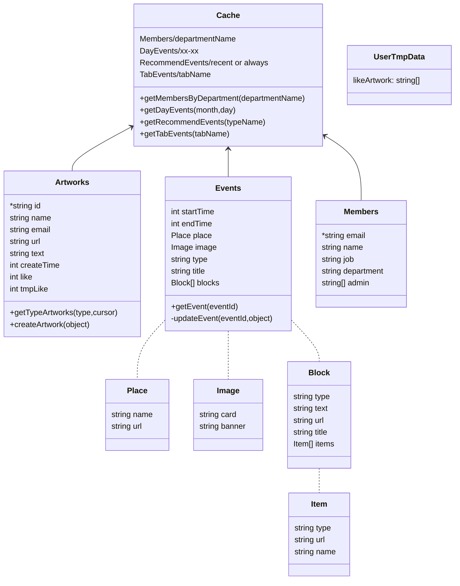

# ntuaf-sdk

## 目的

簡化 ntuaf 專案, 首頁前端資料庫操作

## 架構



## methods

### 用戶相關

```javascript
// 登出
await logout();
// 獲取用戶信箱
userEmail();
// 獲取用戶唯一編號
userId();
// 訂閱登入狀態變更, 常用來抓自動登入產生的結果
subscriptAuthState(callback);
// google 第三方登入
await login();
// 獲取前一次第三方登入的結果
await getLoginResult();
```

### 事件相關(EVENT)

```javascript
// 獲取事件詳細資料
await getEvent(id);
// 校正事件欄位
correctEvent(event);
// 更新事件
await updateEvent(id);
```

### 投稿相關(ARTWORK)

```javascript
// 投稿上轉
await createArtwork({...});
// 當日用戶喜歡的投稿的列表
await getLikeArtworkToday()
// 取得 Artwork 列表, with page
await getArtworkList({...})
// 喜歡或不喜歡某投稿
await triggerLikeArtwork({...})
```

## sample

see each JSDoc for methods above

## types

列舉
see [enums](./dist/types/enums.d.ts)

類別介面
see [interface](./dist/types/types.d.ts)

## dev

### error handle

kill java in monitor when can not start enumerate
